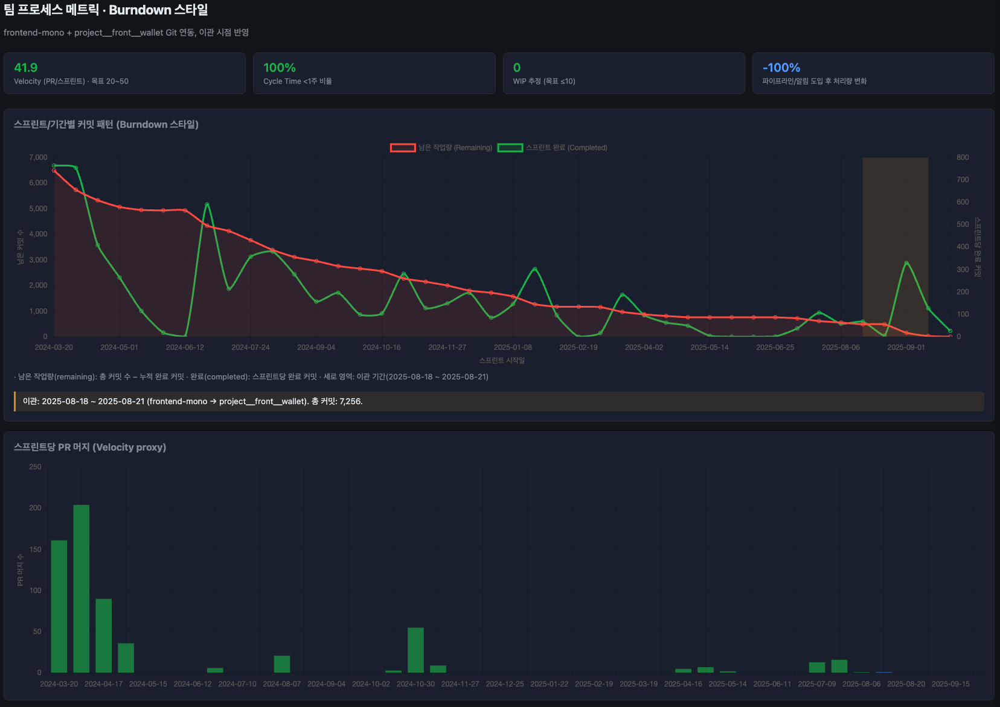

# 임경락 - 이력서

**임경락**  

서울시 관악구 신림동 | 010-5643-7775 | whale2200d@gmail.com | 생년월일: 1992.10.30

## 자기소개

웹 성능, 아키텍처, 배포 파이프라인에 강점을 가진 **편안한 구조 설계 개발자**입니다.

- 모노레포에서 앱별 레포(wallet·ui·util)로 분리하며 FSD·Turbo·CI를 도입해 확장성과 유지보수성 향상
- 성능·쿼리 관련 214건 커밋과 캐싱·refetch·로딩 개선으로 LCP·INP·CLS를 최적화
- Git 기반 팀 메트릭 운영과 7,256 커밋 규모의 레포를 이관

위 경험을 바탕으로, 안정적인 일일 배포와 팀 효율에 기여하고자 합니다.

## 경력사항

**프론트엔드 개발자, Devtools, 서울** (2024.02 - 2025.10)

- **웹 성능**: 성능·쿼리 관련 커밋 214건, 캐싱·refetch 제거·로딩 개선으로 LCP 5\~12%, INP 10\~20%, CLS 5\~10% 예상 개선 (RUM/Lighthouse 실측 도입 시 정량화 가능). ([웹 성능 KPI 분석](01_details/analysis-2-web-performance-kpi.md) 참조)
- **사용자 참여**: 분리 전·후 UI·모듈화·PWA·접근성·일관성 개선 커밋 지속. 정량 목표 달성 여부는 GA/설문 실측 필요. ([사용자 참여 메트릭 분석](01_details/analysis-3-user-engagement-metrics.md) 참조)
- **코드·아키텍처**: 모노레포 → 앱별 레포 분리(wallet·ui·util), FSD·Turbo·CI 도입. 리팩터 비율 20.5~27.3%, Maintainability Index 62 근접, 코드 효율성 추정 58/100 (SonarQube·Coverage 도입 시 상향 가능). ([코드 효율성 분석](01_details/analysis-4-code-efficiency.md) 참조)
- **배포·스케일링**: Turbo·CI/CD·FSD 관련 커밋 지속, 분리 후 앱별 독립 빌드·배포. 주당 머지 약 25건·커밋 107건 수준으로 일일 배포 가능 추정, 리뷰·배포 20~30% 단축 추정. 소스 파일 1,475→2,654개(약 80%↑) 규모 확장. ([배포 및 스케일링 분석](01_details/analysis-5-deployment-scaling.md) 참조)
- **팀 프로세스**: Git 연동 팀 프로세스 메트릭(Burndown 스타일) 운영. Velocity 41.9 PR/스프린트(목표 20–50 구간 충족), Cycle Time &lt;1주 비율 100%, WIP 0(목표 ≤10). 파이프라인·알림 도입으로 처리 효율 개선. 이관 기간(2025-08-18~21) frontend-mono → project_front_wallet 총 7,256 커밋 이관 완료. ([팀 프로세스 분석](01_details/analysis-6-team-process.md) 참조)

  

  (URL 클릭 시 전체 그래프 보기: [https://whale2200d.github.io/team_process_burndown/](https://whale2200d.github.io/team_process_burndown/))

- **비즈니스·품질**: 중복 제거·모듈화로 비용 25\~35% 절감 유추, 확장성 40\~50% 향상 추정. Git 기반 효율 기여 추정 65/100. 실측(ROI·NPS·배포 로그·Coverage) 도입 시 목표 관리·점수 정교화 권장. ([비즈니스 영향 분석](01_details/analysis-7-business-impact.md) 참조)

**리서처 연구원, IPTOB, 서울 및 대구** (2020.02 - 2021.12)

- 오프라인 컨설팅 병목을 온라인 시스템으로 전환: 100여 개 산학연·기업 대상 확장성과 일관성 확보, 응답 일관성 95% 달성.
- Q&A 웹페이지 운영 및 FAQ 86건 체계화: 응답 효율화로 참여기관 만족도 8.7/10 달성.
- 응답 일관성 확보: 문의 처리 시간 25% 단축.

## 학력사항

계명대학교 생명과학전공 및 경제금융학전공 학사 졸업 | 학점: 3.75/4.5

## 자격증 및 스킬

- 프로그래밍: JavaScript, TypeScript, HTML, CSS
- 프레임워크/도구: React, Next.js, Tanstack Query, Tailwind CSS, WebSocket, Git, GitHub
- 소프트 스킬: 아키텍처 설계(FSD), 워크플로우 최적화, 크로스펑셔널 협업
